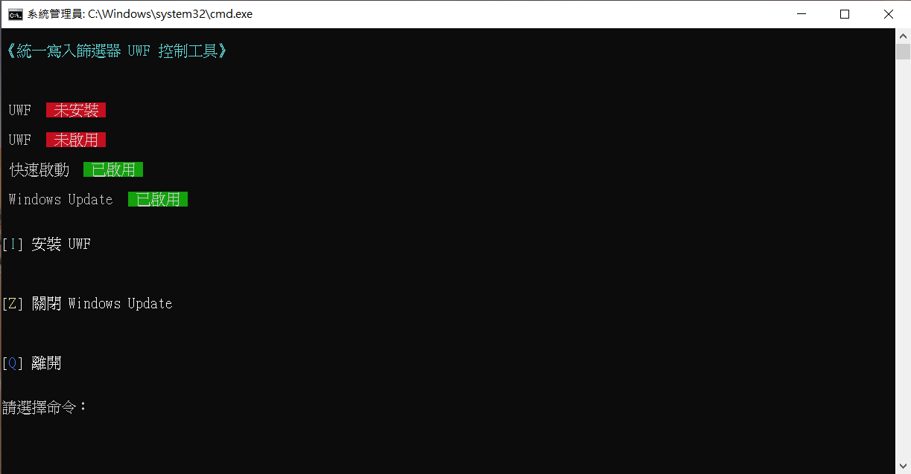

# UWF-cmd-tools-zhtw

Windows 統一寫入篩選器（Unified Write Filter）命令列控制工具

提供 Windows 自動復原軟體的命令列控制工具，需要 Windows 企業版才能使用



## 開發注意事項

因為 Windows 命令列編碼的關係，`.bat` 檔都要以 Big5 編碼存檔才能顯示繁體中文，如果要用 VS Code 開發，建議新增 `.vscode/` 資料夾，裡面新增 `setting.json` 檔案，並新增以下設定：

```js
{
    "[bat]": {
        "files.encoding": "cp950"
    }
}
```

## 參考資料

統一寫入篩選器（Unified Write Filter）官方說明：

- 英文：<https://learn.microsoft.com/en-us/windows/configuration/unified-write-filter/>
- 繁體中文：<https://learn.microsoft.com/zh-tw/windows/configuration/unified-write-filter/>
